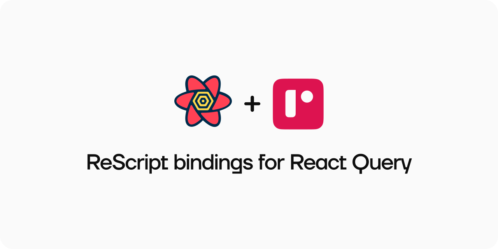

<p align="center">
   
  <br />
  <br />
  <a target="_blank" href="#installation"> Installation </a> //
    <a target="_blank" href="#getting-started"> Getting Started </a> //
    <a target="_blank" href="#supported-features"> Supported Features </a> //
  <a target="_blank" href="https://github.com/rescriptbr"> ReScript Brazil Community </a>
 </p>

## Installation

Install the package using npm/yarn:

```sh
yarn add @rescriptbr/react-query react-query
```

Add the package to `bs-dependencies` in your `bsconfig.json`:

```json
{
"bs-dependencies": [
  "@rescript/react",
  "@rescriptbr/react-query"
 ]
}

```
## Basic usage

```rescript
/* 
* Local bindings for fetch
*/ 
module Fetch = {
  type response

  @send external json: response => Js.Promise.t<'a> = "json"
  @val external fetch: string => Js.Promise.t<response> = "fetch"
}

type todo = {id: string, title: string}

let apiUrl = "https://jsonplaceholder.typicode.com/todos/1"

let fetchTodos = (_): Js.Promise.t<todo> => {
  Fetch.fetch(apiUrl)->Promise.then(Fetch.json)
}

module TodoItem = {
  @react.component
  let make = () => {
    let queryResult = ReactQuery.useQuery(
      ReactQuery.queryOptions(
        ~queryFn=fetchTodos,
        ~queryKey="todos",
        /*
         * Helper functions to convert unsupported TypeScript types in ReScript
         * Check out the module ReactQuery_Utils.res
         */
        ~refetchOnWindowFocus=ReactQuery.refetchOnWindowFocus(#bool(false)),
        (),
      ),
    )

    <div>
      {switch queryResult {
      | {isLoading: true} => "Loading..."->React.string
      | {data: Some(todo), isLoading: false, isError: false} =>
        `Todo Title ${todo.title}`->React.string
      | _ => `Unexpected error...`->React.string
      }}
    </div>
  }
}

/*
 * Create a new client
 */
let client = ReactQuery.Provider.createClient()

@react.component
let make = () => {
  <ReactQuery.Provider client>
    <div> <h1> {React.string("ReScript + React Query")} </h1> <TodoItem /> </div>
  </ReactQuery.Provider>
}
```
<details>
<summary><strong>Checkout the compiler output</strong></summary>
The JavaScript output is simple, very similar to the original API and *almost* zero-cost.

```javascript
// Generated by ReScript, PLEASE EDIT WITH CARE

import * as React from "react";
import * as ReactQuery from "@rescriptbr/react-query/src/ReactQuery.bs.js";
import * as ReactQuery$1 from "react-query";

var Fetch = {};

var apiUrl = "https://jsonplaceholder.typicode.com/todos/1";

function fetchTodos(param) {
  return fetch(apiUrl).then(function (prim) {
    return prim.json();
  });
}

function App$TodoItem(Props) {
  var queryResult = ReactQuery$1.useQuery({
    queryKey: "todos",
    queryFn: fetchTodos,
    refetchOnWindowFocus: ReactQuery.refetchOnWindowFocus({
      NAME: "bool",
      VAL: false,
    }),
  });
  var tmp;
  if (queryResult.isLoading) {
    tmp = "Loading...";
  } else if (queryResult.isError) {
    tmp = "Unexpected error...";
  } else {
    var todo = queryResult.data;
    tmp =
      todo !== undefined ? "Todo Title " + todo.title : "Unexpected error...";
  }
  return React.createElement("div", undefined, tmp);
}

var TodoItem = {
  make: App$TodoItem,
};

var client = new ReactQuery$1.QueryClient();

function App(Props) {
  return React.createElement(ReactQuery$1.QueryClientProvider, {
    client: client,
    children: React.createElement(
      "div",
      undefined,
      React.createElement("h1", undefined, "ReScript + React Query"),
      React.createElement(App$TodoItem, {})
    ),
  });
}

```

</details>

## Supported features
These bindings are work in progress, check out the supported features:

- ✅ `=` Fully implemented
- ⬜ `=` Not implemented yet
- ⚙️ `=` Work in progress
- ⚠️ `=` Partially implemented

### Hooks

- ✅ useQuery 
- ✅ useQueries 
- ✅ useMutation 
- ✅ useInfiniteQuery
- ✅ useQueryClient
- ✅ useQueryErrorResetBoundary
- ✅ useIsFetching
- ✅ useIsMutating

### Providers / Client / Core

- ✅ QueryClientProvider
- ⚙️ QueryClient 
- ⚙️ QueryCache
- ⚙️ MutationCache
- ⚙️ QueryObserver
- ⚙️ InfiniteQueryObserver
- ⚙️ QueriesObserver
- ⚙️ QueryErrorResetBoundary

### Functions / Helpers

- ⬜ focusManager
- ⬜ onlineManager
- ⬜ setLogger
- ⬜ hydration/Hydrate
- ⬜ hydration/useHydrate
- ⬜ hydration/hydrate
- ⬜ hydration/dehydrate

## License
MIT
